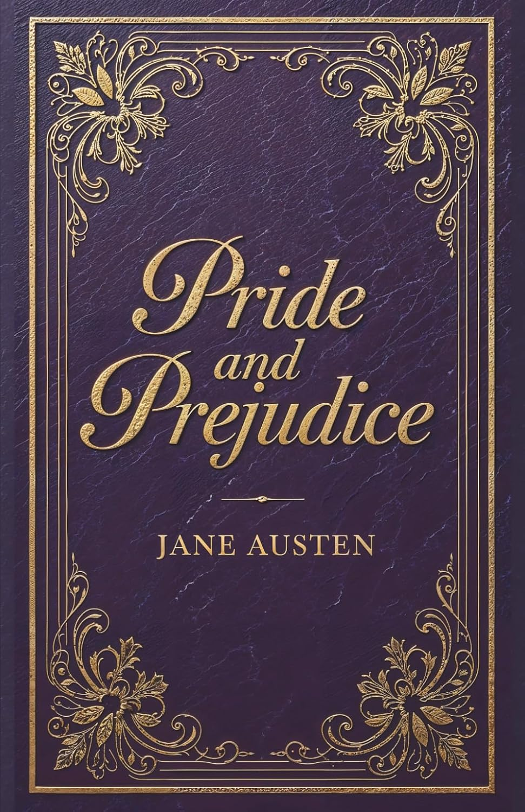
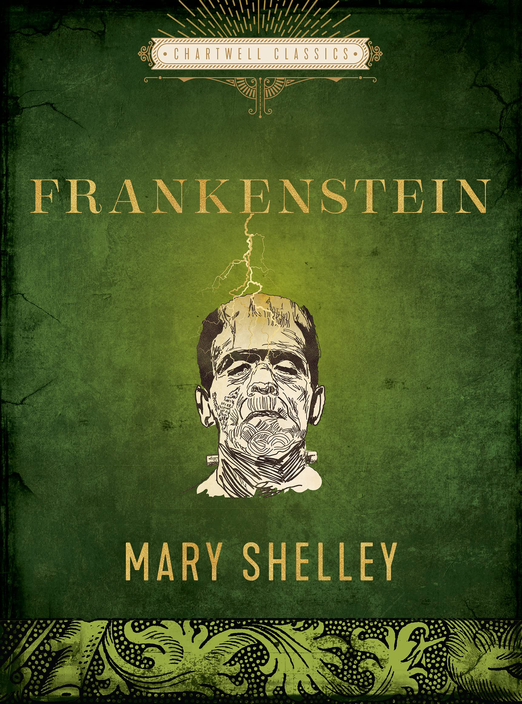
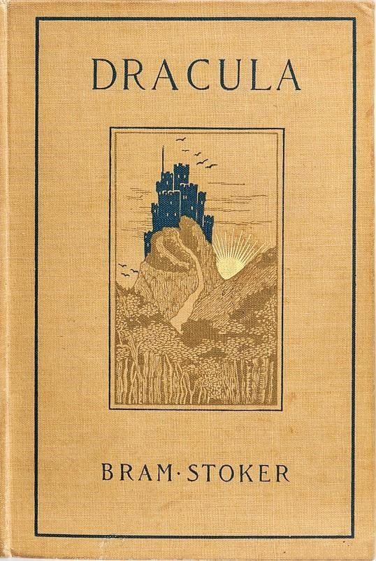

::: {style="display: flex; gap: 1rem; justify-content: center; margin-bottom: 1.5rem;"}
{width=30%}
{width=30%}
{width=30%}
:::

```{r}
#| include: false
library(gutenbergr)
library(tidyverse)
library(tidytext)
library(textdata)
library(scales)
library(ggrepel)
```

```{r}
#| include: false
if (file.exists("classic_novels_raw.csv")) {
  books_raw <- read_csv("classic_novels_raw.csv", show_col_types = FALSE)
} else {
  books_raw <- gutenberg_download(
    gutenberg_id = c(1342, 84, 345),
    meta_fields  = c("title", "author"),
    mirror       = "http://mirrors.xmission.com/gutenberg/"
  )
  write_csv(books_raw, "classic_novels_raw.csv")
}
```

```{r}
#| include: false
books_clean <- books_raw |>
  mutate(
    title = case_when(
      str_detect(title, regex("Pride and Prejudice", ignore_case = TRUE)) ~ "Pride and Prejudice",
      str_detect(title, regex("Frankenstein",        ignore_case = TRUE)) ~ "Frankenstein",
      str_detect(title, regex("Dracula",             ignore_case = TRUE)) ~ "Dracula",
      TRUE ~ title
    ),
    text = str_squish(text)
  ) |>
  filter(text != "") |>
  group_by(title) |>
  mutate(
    line_num = row_number(),
    story_start = case_when(
      title == "Pride and Prejudice" ~ str_detect(
        text, regex("^It is a truth universally acknowledged", ignore_case = TRUE)
      ),
      title == "Frankenstein" ~ str_detect(
        text, regex("^You will rejoice to hear", ignore_case = TRUE)
      ),
      title == "Dracula" ~ str_detect(
        text, regex("^_3 May", ignore_case = TRUE)
      ),
      TRUE ~ FALSE
    )
  ) |>
  mutate(start_line = min(line_num[story_start], na.rm = TRUE)) |>
  filter(line_num >= start_line) |>
  ungroup() |>
  filter(!str_detect(text, regex("^chapter\\b",      ignore_case = TRUE))) |>
  filter(!str_detect(text, regex("^volume\\b",       ignore_case = TRUE))) |>
  filter(!str_detect(text, regex("^book\\b",         ignore_case = TRUE))) |>
  filter(!str_detect(text, regex("^\\[illustration", ignore_case = TRUE))) |>
  filter(!str_detect(text, regex("project gutenberg", ignore_case = TRUE))) |>
  select(gutenberg_id, title, author, line_num, text)
```

```{r}
#| include: false
data(stop_words)

tidy_books <- books_clean |>
  unnest_tokens(output = word, input = text, token = "words") |>
  filter(!word %in% stop_words$word) |>
  filter(!str_detect(word, "^\\d+$")) |>
  filter(!word %in% c("s", "t", "d", "ll", "ve", "re", "m")) |>
  filter(nchar(word) > 1)
```

```{r}
#| include: false
bigrams <- books_clean |>
  unnest_tokens(output = bigram, input = text, token = "ngrams", n = 2) |>
  filter(!is.na(bigram)) |>
  separate(bigram, into = c("word1", "word2"), sep = " ") |>
  filter(!word1 %in% stop_words$word) |>
  filter(!word2 %in% stop_words$word) |>
  filter(!str_detect(word1, "^\\d+$")) |>
  filter(!str_detect(word2, "^\\d+$")) |>
  unite(bigram, word1, word2, sep = " ") |>
  count(title, bigram, sort = TRUE)
```

```{r}
#| include: false
bing <- tidytext::get_sentiments("bing")

sentiment_arc <- books_clean |>
  mutate(chunk = line_num %/% 80) |>
  unnest_tokens(word, text) |>
  filter(!word %in% stop_words$word) |>
  inner_join(bing, by = "word") |>
  count(title, chunk, sentiment) |>
  pivot_wider(names_from = sentiment, values_from = n, values_fill = 0) |>
  mutate(net_sentiment = positive - negative)
```

```{r}
#| include: false
nrc <- tidytext::get_sentiments("nrc")

emotion_counts <- tidy_books |>
  left_join(nrc, by = "word", relationship = "many-to-many") |>
  filter(!is.na(sentiment)) |>
  filter(!sentiment %in% c("positive", "negative")) |>
  count(title, sentiment) |>
  group_by(title) |>
  mutate(pct = n / sum(n))
```

```{r}
#| include: false
book_colors <- c(
  "Pride and Prejudice" = "#2ecc71",
  "Frankenstein"        = "#8e44ad",
  "Dracula"             = "#c0392b"
)

tfidf <- tidy_books |>
  count(title, word) |>
  bind_tf_idf(word, title, n) |>
  group_by(title) |>
  slice_max(tf_idf, n = 12) |>
  ungroup()
```

---

As frequent book readers, we usually attach labels to novels: Pride and Prejudice
is the romance, Frankenstein is the monster story, and Dracula is the vampire
horror. But those labels only tell us what the books are about, not how they
create the feelings we associate with them. In this project, we work directly
with those three famous novels — Jane Austen's Pride and Prejudice (1813),
Mary Shelley's Frankenstein (1818), and Bram Stoker's Dracula (1897) — as data.
We wanted to explore whether the words themselves reveal why these books feel so
different, looking at word frequency, bigrams, sentiment, emotion categories,
and TF-IDF.

## Data and Method

We used the full texts from Project Gutenberg, cleaned to remove headers,
chapter labels, and boilerplate. The cleaned dataset contained 12,981 lines
from Dracula, 10,846 from Pride and Prejudice, and 6,359 from Frankenstein,
yielding 113,129 meaningful word tokens after stop word removal.

## Word Counts: The First Literary Clues

```{r}
tidy_books |>
  count(title, word, sort = TRUE) |>
  group_by(title) |>
  slice_max(n, n = 10) |>
  print(n = 30)
```

In Dracula, frequent words like "night," "door," and "Lucy" evoke darkness and
danger. Frankenstein's top words — "life," "father," "mind" — point to creation
and inner suffering. Pride and Prejudice centers on social names: "Elizabeth,"
"Darcy," "Bennet," reflecting a world of relationships and reputation.

## Bigrams: Seeing Words in Context

```{r}
bigrams |>
  group_by(title) |>
  slice_max(n, n = 10) |>
  print(n = 30)
```

Dracula's bigrams ("Van Helsing," "Madam Mina") show a group fighting a shared
threat. Frankenstein's ("natural philosophy," "dear Victor") reflect science
tied to loneliness. Pride and Prejudice's ("Lady Catherine," "Miss Bennet")
reveal a world defined by titles and rank.

## Sentiment Arc: Emotional Movement Through the Novels

```{r}
#| fig-width: 11
#| fig-height: 7
ggplot(sentiment_arc, aes(x = chunk, y = net_sentiment, color = title)) +
  geom_line(alpha = 0.3, linewidth = 0.55) +
  geom_smooth(se = FALSE, method = "loess", span = 0.3, linewidth = 1.5) +
  geom_hline(yintercept = 0, linetype = "dashed", color = "grey50", linewidth = 0.7) +
  annotate("text", x = 1, y = 3, label = "More positive \u2191",
    color = "grey45", size = 3, fontface = "italic", hjust = 0) +
  annotate("text", x = 1, y = -3, label = "More negative \u2193",
    color = "grey45", size = 3, fontface = "italic", hjust = 0) +
  scale_color_manual(values = book_colors, name = NULL) +
  facet_wrap(~title, scales = "free_x") +
  labs(
    title    = "The Emotional Journey: Sentiment Arc Across Three Classic Novels",
    subtitle = "Each point = 80 lines | Smoothed loess curve shows overall emotional trajectory",
    x        = "Narrative Progression (chunk of 80 lines)",
    y        = "Net Sentiment (positive - negative words)",
    caption  = "Source: Project Gutenberg | Lexicon: Bing (Liu 2004)"
  ) +
  theme_minimal(base_size = 13) +
  theme(
    plot.title = element_text(face = "bold", size = 15),
    plot.subtitle = element_text(color = "grey40"),
    legend.position = "none",
    panel.grid.minor = element_blank(),
    strip.text = element_text(face = "bold", size = 12)
  )
```

Pride and Prejudice has a stable emotional pattern with dips during moments of
rejection and scandal. Frankenstein darkens steadily as ambition turns to guilt.
Dracula is the most unpredictable, shifting between fear and hope as different
characters narrate events.

## Emotion Analysis: Fear and Joy

Using the NRC lexicon, Dracula leads in fear words (16.3%), followed by
Frankenstein (15.7%) and Pride and Prejudice (10.5%). For joy, Pride and
Prejudice leads (17.3%), consistent with its genre as a romantic comedy ending
in happiness.

## TF-IDF: Each Novel's Literary Fingerprint

```{r}
#| fig-width: 11
#| fig-height: 8
tfidf |>
  mutate(word = reorder_within(word, tf_idf, title)) |>
  ggplot(aes(x = tf_idf, y = word, color = title)) +
  geom_segment(aes(x = 0, xend = tf_idf, y = word, yend = word),
    linewidth = 1.0, alpha = 0.65) +
  geom_point(size = 4.5, alpha = 0.95) +
  scale_y_reordered() +
  scale_color_manual(values = book_colors) +
  scale_x_continuous(expand = expansion(mult = c(0, 0.1))) +
  facet_wrap(~title, scales = "free_y") +
  labs(
    title    = "Literary Fingerprints: The Words That Define Each Novel",
    subtitle = "Top 12 words by TF-IDF score — higher = more unique to that book vs the other two",
    x        = "TF-IDF Score",
    y        = NULL,
    caption  = "Source: Project Gutenberg via gutenbergr R package"
  ) +
  theme_minimal(base_size = 13) +
  theme(
    plot.title = element_text(face = "bold", size = 15),
    plot.subtitle = element_text(color = "grey40"),
    legend.position = "none",
    panel.grid.minor = element_blank(),
    panel.grid.major.y = element_blank(),
    strip.text = element_text(face = "bold", size = 12)
  )
```

Dracula's fingerprint is dominated by character names and "Diary," reflecting
its documentary style. Frankenstein's contrast between "Creator" and "Murderer"
captures Victor's moral failure. Pride and Prejudice's distinctive words are
entirely social — names tied to family, marriage, and reputation.

## Conclusion

The three novels differ not just in plot but in the emotional worlds they build
through language. Austen creates a world of social performance, Shelley explores
moral consequence, and Stoker builds collective survival against the unknown.
Text analysis cannot capture irony or symbolism fully, but it helps us see
patterns that traditional reading might miss.

## References

- Project Gutenberg: https://www.gutenberg.org
- gutenbergr R package: https://docs.ropensci.org/gutenbergr
- Text Mining with R (Silge & Robinson): https://www.tidytextmining.com

## Source code

[Text analysis project repository](https://github.com/ADC-405-S26/Project_3_TextAnalysis_Team_2)